---
format:
  revealjs:
    title-slide: false
    slide-level: 1
    theme: [default, theme.scss]
    slide-number: c/t
    width: 1600
    height: 900
    transition: fade
    background-transition: fade
    footer: 'Bergische Universität Wuppertal · Lehrstuhl für Digital Humanities·<a class="footer-contact" href="mailto:politycki@uni-wuppertal.de" aria-label="E-Mail an Bastian Politycki"><i class="bi-envelope" aria-hidden="true"></i>politycki@uni-wuppertal.de</a>·<a class="footer-contact" href="https://github.com/Bpolitycki" aria-label="GitHub-Profil von Bastian Politycki"><i class="bi-github" aria-hidden="true"></i>github.com/Bpolitycki</a>'
---

::: {.icon-dependency aria-hidden="true"}

:::

# Editionsagenten {.title-slide .center}

::: {.title-subtitle}
Wie gestalten große Sprachmodelle digitale Editionen?
:::

::: {.title-meta}

Bastian Politycki

Editopia 2026 · Wuppertal · 2.–4. September 2026

:::

# {.question-slide}

::: {.edition-question}
> Was ist eine digitale Edition?
:::

# Was ist eine digitale Edition? {.image-slide}

::: {.image-stage}
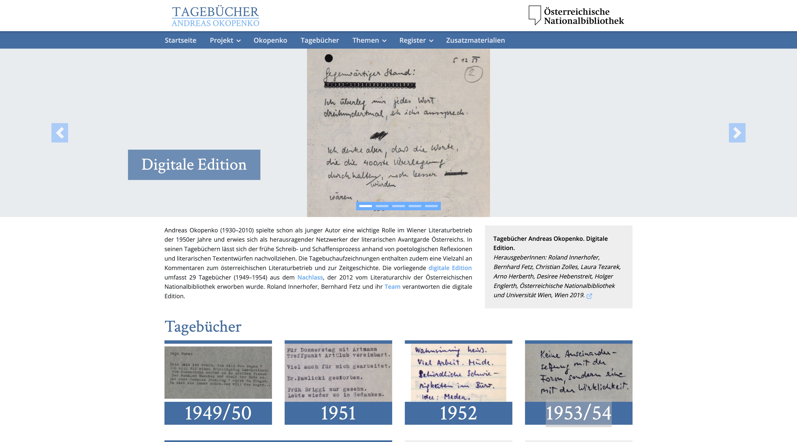{fig-alt="Startseite der digitalen Edition der Tagebücher Andreas Okopenkos"}
:::

::: {.image-citation}
Okopenko, Andreas: *Tagebücher 1949–1954. Digitale Edition*, hrsg. von Roland Innerhofer, Bernhard Fetz, Christian Zolles, Laura Tezarek, Arno Herberth, Desiree Hebenstreit, Holger Englerth, Österreichische Nationalbibliothek und Universität Wien. Wien: Version 2.0, 21.11.2019. URL: [https://edition.onb.ac.at/okopenko](https://edition.onb.ac.at/okopenko)
:::

# Schichtenmodell einer digitalen Edition {.image-slide}

::: {.image-stage}
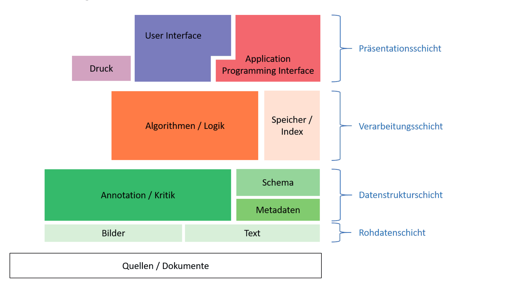{fig-alt="Schichtenmodell einer digitalen Edition nach Frederike Neuber"}
:::

::: {.image-citation}
Neuber, Frederike (2023): „Der digitale Editionstext. Technologische Schichten, ‚editorischer Kerntext‘ und datenzentrierte Rezeption“. In: Fröhlich, Niklas / Politycki, Bastian / Schäfer, Dirk / Sonder, Annkathrin (Hg.): *Der Text und seine (Re)Produktion* (= Beihefte zu editio 55). Berlin/Boston: De Gruyter, S. 69–84.
:::

# Edition als Vermittlung {.image-slide}

::: {.image-stage .process-graphic}
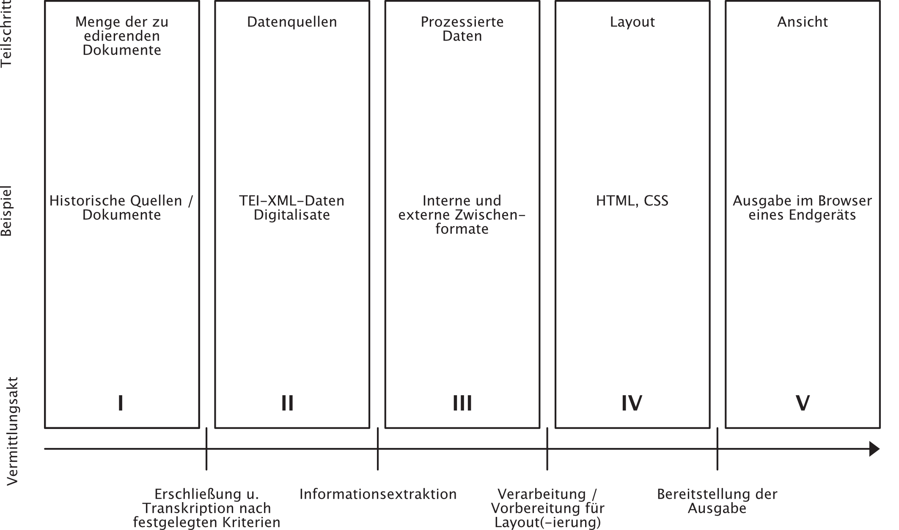{fig-alt="Der Vermittlungsprozess digitaler Editionen von historischen Quellen über Daten und Layout bis zur Ansicht"}
:::

# {.quote-slide}

::: {.quote-reveal .fragment}
::: {.quote-stage}
> Digitale Editionen machen durch Erschließung und Wiedergabe unser kulturelles und geistiges Erbe sichtbar, zugänglich und nutzbar. Editionen sind eine Kernaufgabe der Wissenschaften und bilden die Grundlage für weitere Forschung.
:::

::: {.quote-citation}
Fritze, Christiane (2022): „Manifest für digitale Editionen“. In: *Dhd Blog*. [https://dhd-blog.org/?p=17563](https://dhd-blog.org/?p=17563) [letzter Zugriff: 1. September 2026].
:::
:::

# KI in der digitalen Editorik

::: {.fragment}

### Bisher vor allem

- Transkription
- Annotation
- Normalisierung
- Entitätenerkennung
- Recherche / Retrieval

::: {.literature-note}
**Vgl. u. a.** Hess, Jan (2024): „Von OCR und HTR bis NER und LLM: Zur (Teil-)Automatisierung digitaler Editions- und Transformationsprozesse“, in: *editio* 38 (1), S. 147–162, [doi:10.1515/editio-2024-0009](https://doi.org/10.1515/editio-2024-0009). · Galka, Selina / Vogeler, Georg (2026): „Annotating, projecting, and interpreting named entities in digital scholarly editions with LLMs“, in: *International Journal of Digital Humanities* 7 (3), S. 483–509, [doi:10.1007/s42803-025-00114-8](https://doi.org/10.1007/s42803-025-00114-8).
:::
:::

# Vom Sprachmodell zum Coding-Agenten

Coding-Agenten verbinden ein Sprachmodell mit Werkzeugen für:

- Dateioperationen
- Codegenerierung
- Shell / Programme
- Suche im Repository
- iterative Fehlerkorrektur
- ...

::: {.literature-note}
**Vgl. u. a.** Wang, Huanting / Gong, Jingzhi / Zhang, Huawei / Xu, Jie / Wang, Zheng (2025): „AI Agentic Programming: A Survey of Techniques, Challenges, and Opportunities“. *arXiv*. [https://arxiv.org/abs/2508.11126](https://arxiv.org/abs/2508.11126) [letzter Zugriff: 20. März 2026].
:::

# {.question-slide}

::: {.edition-question}
> Welche editorischen Ordnungen entstehen, wenn verschiedene Coding-Agenten auf Grundlage derselben Editionsdaten selbstständig eine Benutzeroberfläche entwickeln?
:::

# Versuchsanordnung

::: {.setup-dataset}
**Gemeinsame Datengrundlage**
*Digitale Edition der Tagebücher Andreas Okopenkos*
TEI-Transkriptionen · Register · Stand-off-Kommentare · redaktionelle Texte · projektspezifisches Schema · IIIF-Faksimiles
:::

### Verglichene Systeme

::: {.agent-run}
**Claude Code** · Modell: Opus 5 · Reasoning: Medium
:::

::: {.agent-run}
**OpenAI Codex** · Modell: GPT-5.6 Sol · Reasoning: Medium
:::

::: {.agent-run}
**OpenCode** · Modell: Kimi K3 · Reasoning: Default
:::

::: {.setup-task}
**Identische Aufgabenfolge** · Repository analysieren → Webanwendung entwickeln → eigene Lösung prüfen und überarbeiten
:::

::: {.setup-repositories}
**Coding-Lab**  
[github.com/Bpolitycki/agentic_ed_coding_lab](https://github.com/Bpolitycki/agentic_ed_coding_lab)

**Dokumentation & Foliensatz**  
[github.com/Bpolitycki/agentic_ed_coding_dok](https://github.com/Bpolitycki/agentic_ed_coding_dok)
:::

<small>Qualitative Exploration · identische Datenbasis · funktional vergleichbare Zugriffsrechte · getrennte Runs</small>

# Erwartungshorizont

::: {.expectation-intro}
**Kein Bewertungsschema**
 Qualitative vergleichende Analyse möglicher Muster bei der automatisierten Erzeugung von Interfaces
:::

### Erwartete Muster

::: {.expectation-row}
**Editionsmodell**

- Grundstruktur nachvollziehbar rekonstruieren
- Makrostruktur vor editorischem Detail
:::

::: {.expectation-row}
**Technik & Gestaltung**

- generische UI-Muster
- komplexere Informationen eher in sekundären Ansichten
:::

::: {.expectation-row}
**Sichtbarkeit & Gewichtung**

- Lesbarkeit und Entitäten tendenziell besonders prominent
- Materialität und schwer darstellbare Phänomene eher nachgeordnet
:::

::: {.expectation-row}
**Unterschiedliche Schwerpunkte**

- gleiche Daten, unterschiedliche Schwerpunkte
- Raum für überraschend differenzierte Lösungen
:::

# Befund 1: Die Agenten verstehen erstaunlich viel

::: {.finding-intro}
**Gemeinsamer Ausgangsbefund**
Alle drei Systeme erzeugen lauffähige, statische Webanwendungen.
:::

### Rekonstruiertes Editionsmodell

::: {.expectation-row}
**Editionstyp & Bestandteile**

- TEI-Transkriptionen, Register, Kommentare und Faksimiles
- editorische Eingriffe und Unsicherheiten
:::

::: {.expectation-row}
**Verschränkte Ordnungen**

- materielle Seitenordnung
- textuelle Eintragsstruktur und Chronologie
:::

::: {.expectation-row}
**Editorische Differenzierung**

- Lesefassung und diplomatische Umschrift
- semantisch differenzierte Registerrelationen
:::

# Befund 2: Lesbarkeit ohne Verlust der Materialität {.image-slide}

::: {.image-stage}
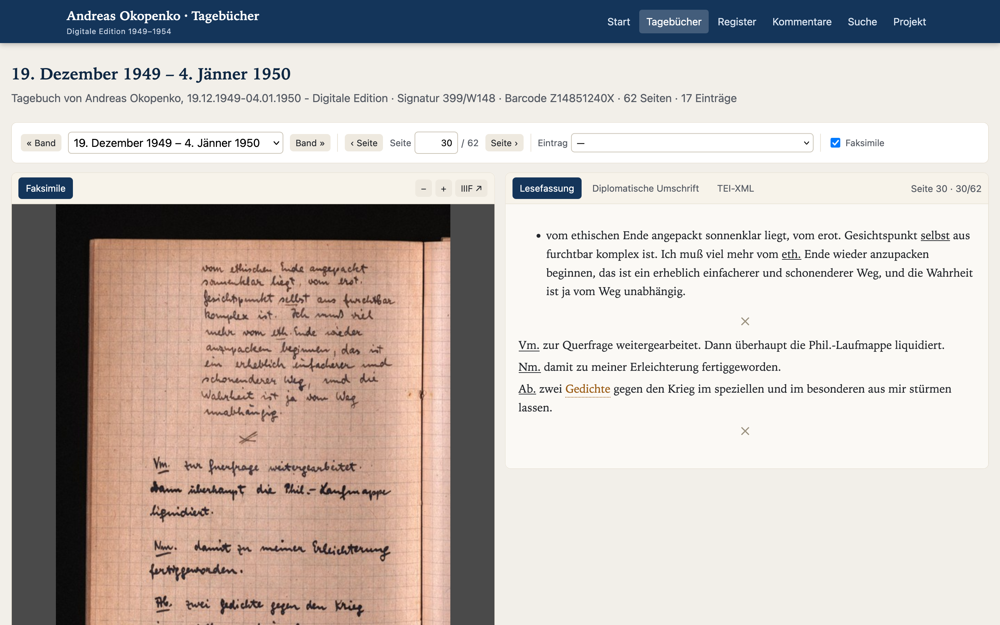{fig-alt="Reader-Ansicht der OpenCode-Implementierung mit Faksimile, Lesetext sowie Umschaltern für diplomatische Umschrift und TEI"}
:::

::: {.reader-takeaway}
**Lesefassung als Einstieg – nicht als Reduktion.** Faksimile, diplomatische Umschrift und TEI/XML bleiben als gestaffelte Repräsentationen erreichbar.
:::

# Lektüreangebote und wissenschaftliche Grenzen

::: {.framing-comparison}
::: {.framing-shot}
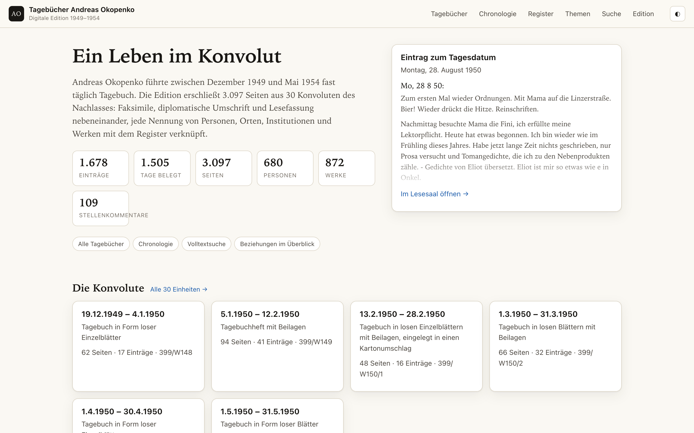{fig-alt="Startseite der Claude-Implementierung mit Verweis auf den Lesesaal"}

::: {.framing-label}
**Claude** · „Lesesaal“
:::
:::

::: {.framing-shot}
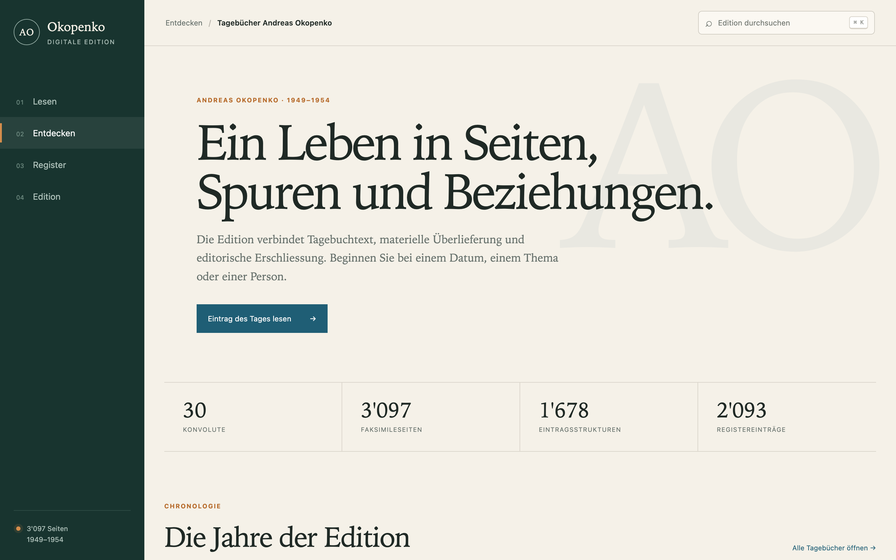{fig-alt="Startseite der Codex-Implementierung mit dem Leitmotiv Ein Leben in Seiten, Spuren und Beziehungen"}

::: {.framing-label}
**Codex** · „Ein Leben in Seiten, Spuren und Beziehungen“
:::
:::
:::

::: {.finding-row}
**Wissenschaftliche Funktionen** · Keine der drei Anwendungen bietet eine Zitierempfehlung oder Zitierfunktion.
:::

::: {.finding-row}
**Adressierbarkeit** · Claude und OpenCode erzeugen referenzierbare Ansichten; Codex folgt stärker einer App-Logik ohne eigene URL-History.
:::

# Befund 3: Entitäten werden zu Interface-Standards

::: {.finding-intro}
**Starke Konvergenz** 
Personen, Orte, Werke und Institutionen sind scheinbar leicht in etablierte Webinteraktionen zu übersetzen.
:::

### Entitäten in der Oberfläche

::: {.expectation-row}
**Verknüpfung im Text**

- Inline-Links und direkt erreichbare Entitäten
- Fundstellen als Übergang zwischen Text und Register
:::

::: {.expectation-row}
**Etablierte Interaktion**

- Register, Detailansichten, Suche und Filter
- komplexere editorische Phänomene seltener strukturprägend
:::

::: {.framing-comparison}
::: {.framing-shot}
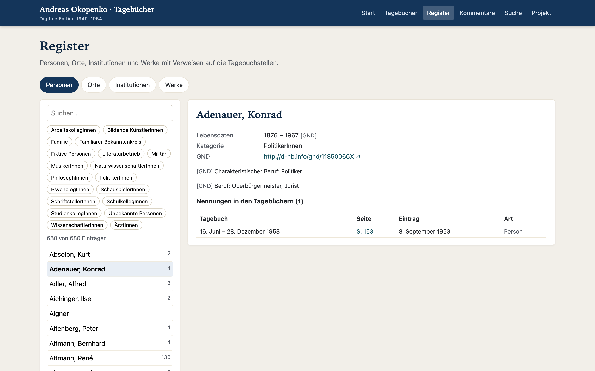{fig-alt="Register der OpenCode-Implementierung"}

::: {.framing-label}
**OpenCode** · Einzelansicht im Personenregister
:::
:::

::: {.framing-shot}
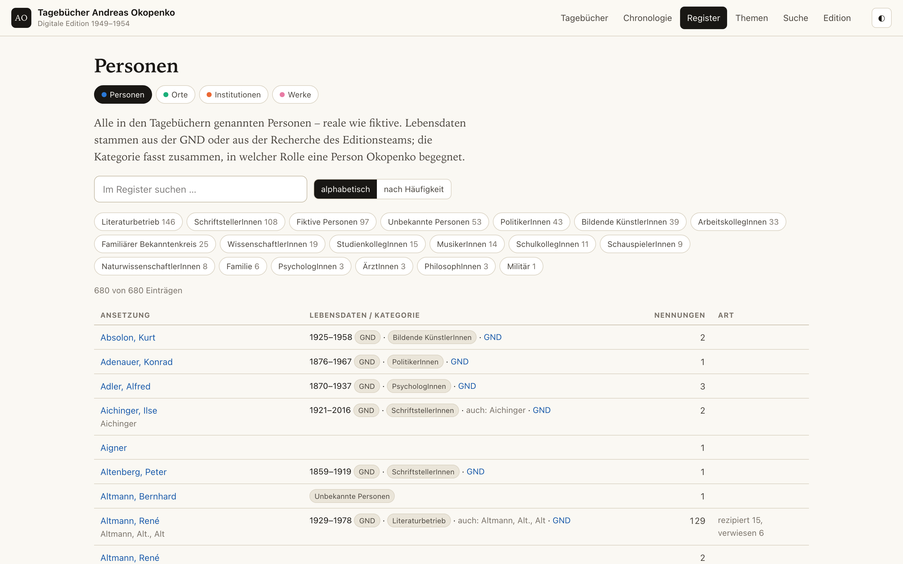{fig-alt="Personenregister der Claude-Implementierung"}

::: {.framing-label}
**Claude** · Gesamtansicht im Personenregister
:::
:::

::: {.framing-shot}
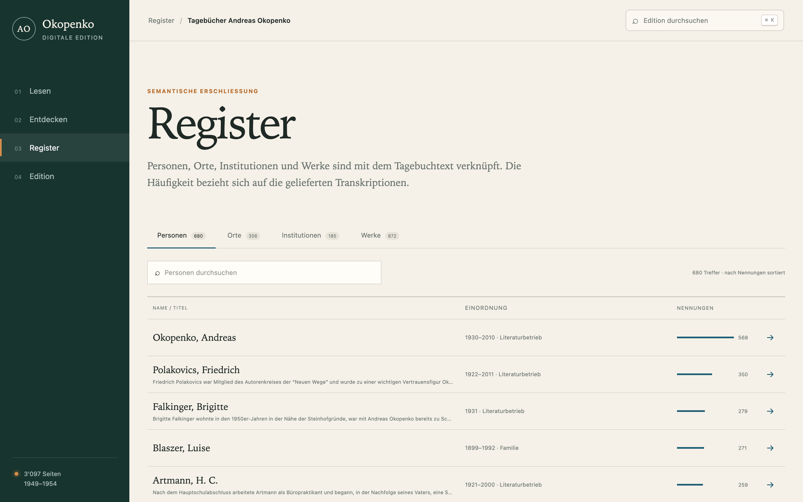{fig-alt="Register der Codex-Implementierung"}

::: {.framing-label}
**Codex** · Personenregister mit Sortierung nach Häufigkeit
:::
:::
:::

# Befund 4: Zählbarkeit wird zu Sichtbarkeit {.image-slide}

::: {.image-stage}
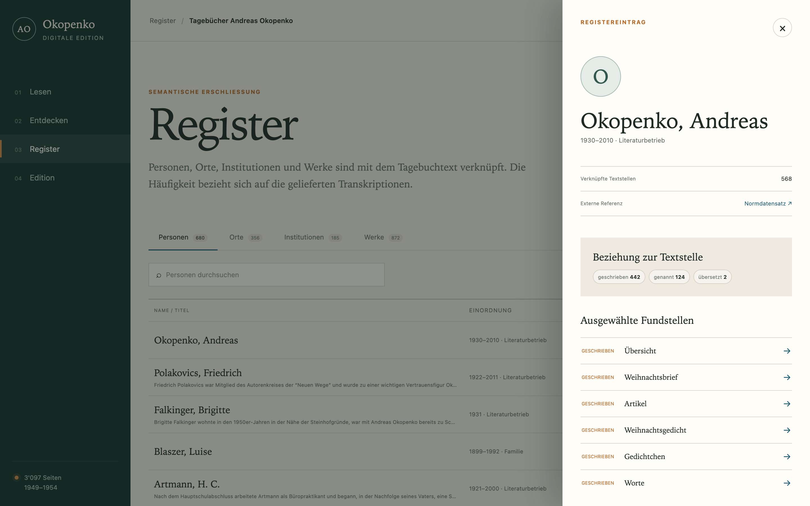{fig-alt="Registeransicht der Codex-Implementierung mit Zählung verknüpfter Textstellen, Relationstypen und ausgewählten Fundstellen"}
:::

# Befund 5: Gleiche Daten – unterschiedliche Editionen

::: {.framing-comparison}
::: {.framing-shot}
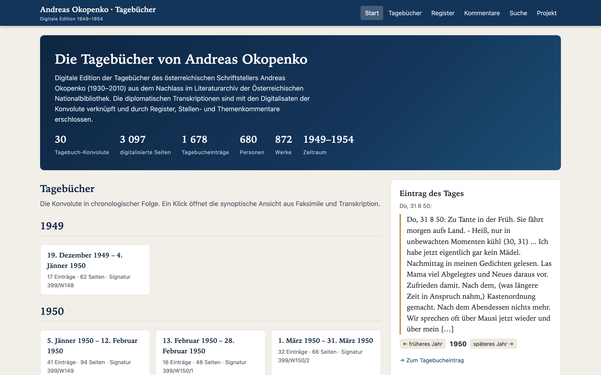{fig-alt="Startseite der OpenCode-Implementierung"}

::: {.framing-label}
**OpenCode** · Editionsportal
:::
:::

::: {.framing-shot}
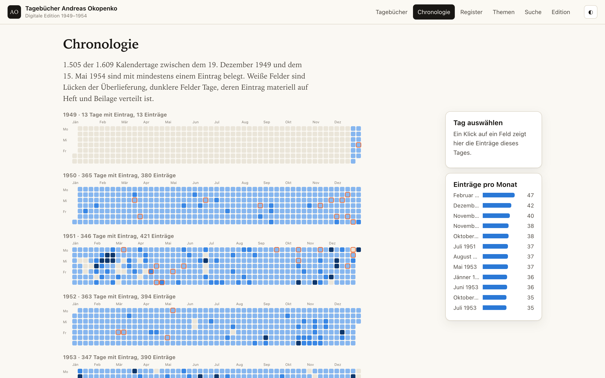{fig-alt="Chronologie der Claude-Implementierung"}

::: {.framing-label}
**Claude** · Forschungs- und Explorationsraum
:::
:::

::: {.framing-shot}
{fig-alt="Startseite der Codex-Implementierung"}

::: {.framing-label}
**Codex** · kuratierter Forschungsreader
:::
:::
:::

::: {.finding-row}
Die größten Unterschiede liegen nicht im Datenverständnis, sondern in Rahmung, Gewichtung und Nutzbarmachung.
:::

# Fazit: Edition nach der Edition?

::: {.expectation-intro}
**Edition als Funktion** 
Sie realisiert sich erst in einer konkreten Präsentations- und Nutzungssituation.
:::

::: {.expectation-row}
**Kontinuität**

- Technische Werkzeuge prägen seit langem Transformations- und Darstellungslogiken.
:::

::: {.expectation-row}
**Verschiebung durch Coding-Agenten**

- Sie wenden kein festes Publikationsmodell an, sondern erzeugen eine situative Lösung aus Trainingsmustern, Werkzeugen und Prompt.
:::

::: {.expectation-row}
**Editorische Verantwortung**

- Welche erzeugten Ordnungen akzeptieren, korrigieren oder begründen wir?
:::
